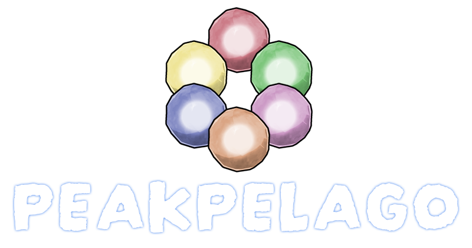

# PEAK Archipelago Mod

An Archipelago integration mod for the game PEAK, allowing the game to be played as part of a multiworld randomizer.

Also available on Thunderstore: https://thunderstore.io/c/peak/p/PeakArchipelago/PEAKPELAGO/

## Overview

This mod connects PEAK to the [Archipelago](https://archipelago.gg/) multiworld randomizer system. Ascent unlocks, badges, and other progression items are randomized across multiple games and players, creating a unique cooperative or competitive experience.

## Client Plugin Installation

### Thunderstore Install
1. **Install Mod Loader/Manager**:
   - Download a mod manager like [Gale Mod Manager](https://thunderstore.io/c/peak/p/Kesomannen/GaleModManager/)

2. **Install the PEAKPELAGO Mod**:
   - Download [PEAKPELAGO Mod](https://thunderstore.io/c/peak/p/PeakArchipelago/PEAKPELAGO/)

3. **Launch the Game**:
   - Start PEAK - the plugin will create a configuration file on first run
   - Connect using the in game UI

### Manual Install
1. **Install BepInEx**:
   - Download BepInEx 5.x for your platform
   - Extract to your PEAK game directory
   - Run the game once to generate BepInEx folders

2. **Install the Plugin**:
   - Download the `peakpelago` folder from the releases
   - Drag the entire `peakpelago` folder into your `BepInEx/plugins/` directory
   - The folder contains all necessary files
   - If you have a PeakArcihpelagoPluginDLL folder still, delete it

3. **Launch the Game**:
   - Start PEAK - the plugin will create a configuration file on first run
   - Connect using the in game UI

## Archipelago World Installation

1. **Locate Archipelago Installation**:
   - Double click the peak.apworld file to install the PEAK AP World into your Archipelago installation

### How to Play

1. **Generate a Multiworld**:
   - Create a YAML configuration for your PEAK world
   - Generate the multiworld using Archipelago's generator
   - Host or join a multiworld session

2. **Start PEAK**:
   - Launch the game with the mod installed
   - The in-game UI will show connection status

3. **Connect to Archipelago**:
   - Use the in-game menu in the top left
   - Fill in the connection details and click Connect or hit Enter

4. **Play the Game**:
   - Ascents are initially locked - unlock them by receiving items
   - Collecting items and completing objectives sends checks to other players
   - Receive items from other players as they complete their objectives
   - Work together (or compete) to complete your goals!

### Multiplayer

If you wish to climb the PEAK with your friends you can do so!
All players just need to download the PEAKPELAGO Mod for their PEAK Game and join you as they would normally.
The AP Connection UI will update to show that it's connected via the host

If someone joining the Host has their AP connection set to their own slot, anything connected to AP will likely only affect the Host's AP slot.

# Links

## DeathLink

Death Link has a few behaviors to choose from.

### Receiving Behavior:
Kill Random Player: A random player in your lobby will be killed
Reset to Last Checkpoint: All players will be teleported to the last checkpoint/campfire

### Sending Behvaior:
Any Player Dies: Send Death Link whenever any player in your game dies
All Players Dead: Send Death Link only when all players are dead (game over)

## RingLink/HardRingLink

### RingLink
With RingLink enabled, your stamina bars are conditionally linked to other RingLink games.
Consuming food will send Rings to other players with Ring Link enabled. Poisonous food will send negative rings.
Positive and Negative rings recieved will affect your Extra Stamina first, then your regular Stamina.
### HardRingLink
With HardRingLink enabled, your stamina bars are conditionally linked to other HardRingLink games.
While rings received is largely unchanged, the rings you send out only happens on specific events.
Wrecking food while cooking, Causing the Scoutmaster to appear, Reaching the ends of Biomes, Dying and/or Zombifying will send out negative rings.

## EnergyLink

With EnergyLink enabled, an EnergyLink Vendor will appear at each campfire. Each one will have 1 randomized Item bundle inside that you can spend energy on to receive.
Any items you pick up will now have another interaction called Convert which will convert the item into energy, destroying it in the process.
Most items are 100J of energy, while some have unique values.

## TrapLink

With TrapLink enabled, any Traps you receive or find will send out to TrapLinked games that are able to accept them. When linked games do the same, you
will recieve a linked trap as well based on the type of trap.