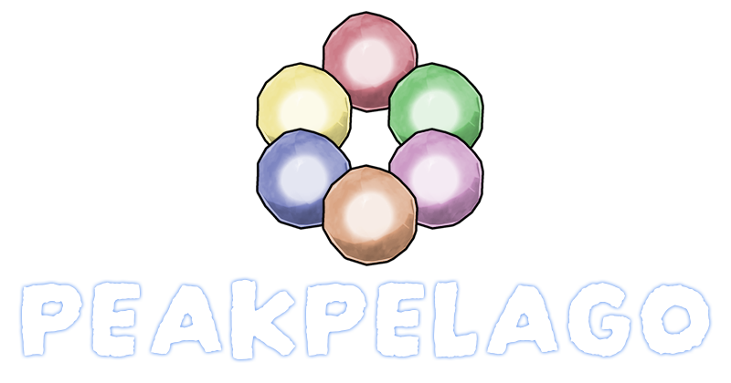

# PEAK Archipelago Mod

An Archipelago integration mod for the game PEAK, allowing the game to be played as part of a multiworld randomizer.

Also available on Thunderstore: https://thunderstore.io/c/peak/p/PeakArchipelago/PEAKPELAGO/

## Overview

This mod connects PEAK to the [Archipelago](https://archipelago.gg/) multiworld randomizer system. Ascent unlocks, badges, and other progression items are randomized across multiple games and players, creating a unique cooperative or competitive experience.

## Features

- **Ascent Progression**: Unlock ascents (1-7) by receiving Archipelago items
- **Badge Randomization**: Badges are tracked and managed through Archipelago
- **Location Checks**: Game events and collectibles send progression to other players
- **DeathLink Support**: Optional death synchronization with other players
- **RingLink Support**: Optional support for linking Stamina to Rings in participating games. Consuming edible items will have effects on Rings
- **HardRingLink Support**: Optional support for linking Stamina to Rings in participating games. Certain actions and events will have effects on Rings
- **Auto-Reconnect**: Automatically reconnects to the Archipelago server if disconnected
- **Persistent State**: Tracks received items and checked locations across game sessions
- **Real-time Integration**: Seamlessly integrates with PEAK's gameplay

## Components

This mod consists of two main components:

### 1. Client Plugin (C# / BepInEx)
- **File**: `PeakArchipelagoPlugin.cs`
- **Purpose**: Runs inside the PEAK game client
- **Dependencies**: BepInEx, Archipelago.MultiClient.Net, Harmony

### 2. Archipelago World (Python)
- **Location**: `peak/` directory
- **Purpose**: Defines game logic, items, locations, and rules for the Archipelago server
- **Files**:
  - `__init__.py` - Main world definition
  - `Items.py` - Item definitions and classifications
  - `Locations.py` - Location (check) definitions
  - `Options.py` - Player-configurable options
  - `Regions.py` - Game region structure
  - `Rules.py` - Progression logic and access rules

## Installation

### Client Plugin Installation

## Manual Install
1. **Install BepInEx**:
   - Download BepInEx 5.x for your platform
   - Extract to your PEAK game directory
   - Run the game once to generate BepInEx folders

2. **Install the Plugin**:
   - Download the `peakpelago` folder from the releases
   - Drag the entire `peakpelago` folder into your `BepInEx/plugins/` directory
   - The folder contains all necessary files

3. **Launch the Game**:
   - Start PEAK - the plugin will create a configuration file on first run
   - Connect using the in game UI

### Archipelago World Installation

1. **Locate Archipelago Installation**:
   - Double click the peak.apworld file to install the PEAK AP World into your Archipelago installation

## Configuration

### World Options

When generating an Archipelago game, the following PEAK-specific options are available:

- **Goal**: Choose between "Reach Peak", "Complete All Badges" or "24 Karat Badge"
- **Required Ascent Count**: Number of ascents needed to complete (0-7, default: 4)
- **Required Badge Count**: Number of badges needed for badge completion goal (10-50, default: 20)
- **Progressive Stamina**: Start with 25% Stamina and require finding Progressive Stamina Bars to reach 100%
- **Additional Stamina**: With Progressive Stamina enabled, find 4 extra Stamina Bars to reach a total of 200% Stamina
- **Trap Weigh Percent**: Determine the amount of filler items to get replaced with traps.
- **Ring Link**: Enable RingLink with other linked players.
- **Hard Ring Link**: Enable HardRingLink with other linked players.
- **Trap Link**: Enable TrapLink with other linked players.
- **Energy Link**: Enable EnergyLink to utilize a linked Energy bank with other linked players.
- **Death Link**: Enable death synchronization with other players
- **Death Link Behavior**: Choose between full run reset or checkpoint reset
- **Death Link Send Behavior**: Choose between sending on any players death or on failed run

## How to Play

1. **Generate a Multiworld**:
   - Create a YAML configuration for your PEAK world
   - Generate the multiworld using Archipelago's generator
   - Host or join a multiworld session

2. **Start PEAK**:
   - Launch the game with the mod installed
   - The in-game UI will show connection status

3. **Connect to Archipelago**:
   - Use the in-game menu in the top left
   - Fill in the connection details and click Connect or hit Enter

4. **Play the Game**:
   - Ascents are initially locked - unlock them by receiving items
   - Collecting items and completing objectives sends checks to other players
   - Receive items from other players as they complete their objectives
   - Work together (or compete) to complete your goals!

## Development

### Building the Client Plugin

Requirements:
- .NET Framework compatible with Unity
- BepInEx 5.x references
- Archipelago.MultiClient.Net library
- Harmony library
- PEAK game assemblies for reference

### Modifying the World

The Python world code follows Archipelago's world API:
- Modify `Items.py` to add/change items
- Update `Locations.py` for new location checks
- Edit `Rules.py` to adjust progression logic
- Change `Options.py` to add player options

### Testing

1. Test the client plugin in isolation with debug logging enabled
2. Generate test multiworld with only PEAK
3. Verify item receiving and location checking
4. Test with other Archipelago games for integration

## Troubleshooting

### Plugin Not Loading
- Verify BepInEx is installed correctly
- Check `BepInEx/LogOutput.log` for errors
- Ensure all dependencies are in the plugins folder

### Cannot Connect to Server
- Verify server address and port in config
- Check firewall settings
- Ensure the Archipelago server is running and accessible

### Items Not Received
- Check connection status in UI
- Verify slot name matches your generated world
- Review state file for corruption: `BepInEx/config/Peak.AP.state.*.txt`

### Locations Not Checking
- Ensure you're connected to the server
- Check that the location exists in the world definition
- Review debug logs for check submission errors

## Credits

- **Mod Contributors**: ArchipelagoBrad, ManNamedGarbo, [Mickemoose](https://ko-fi.com/mickemoose), [Dmonet](https://bsky.app/profile/dmonett.bsky.social)
- **EnergyLink Vendor Assets**: [Dmonet](https://bsky.app/profile/dmonett.bsky.social)
- **Archipelago**: [Archipelago Team](https://archipelago.gg/)
- **PEAK**: [Landfall](https://landfall.se/) & [Aggro Crab](https://aggrocrab.com/)
- **BepInEx**: [BepInEx Team](https://github.com/BepInEx/BepInEx)

## Version

Current Version: **0.5.1**

## Links

- [Archipelago Website](https://archipelago.gg/)
- [Archipelago Discord](https://discord.gg/archipelago)
- [BepInEx Documentation](https://docs.bepinex.dev/)

---

**Note**: This is a fan-made mod and is not affiliated with or endorsed by the original PEAK developers.

